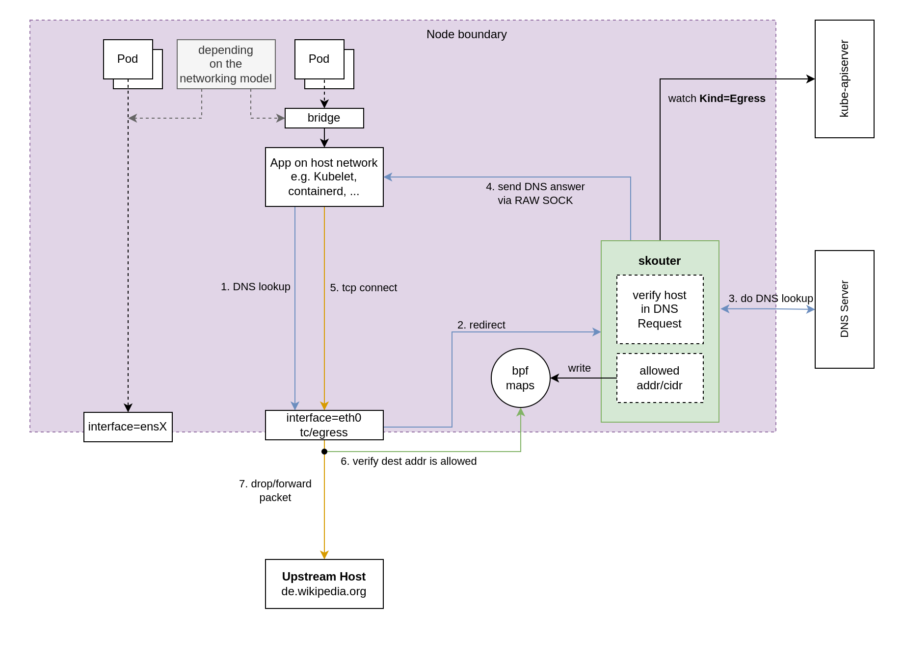

# Skouter

cloud-native egress proxy.

---


## Iteration 1: parse DNS response in userspace



## Rationale

This is a counter-draft to the traditional centralized egress firewall approach.

Requirements:
* provide a **DNS-based firewall** to allow/deny egress traffic
* **no change of existing applications needed**: an app must not rely on `HTTP_PROXY` env variables or iptables traffic redirection
* **no central infrastructure** for egress filtering: No single point of failure. Eliminate complexity introduced by HA architecture like leader election, state replication, snapshots for DR, VRRP.

It runs on a cgroup2 skb hook. Essentially, all Kubernetes traffic from pods is subject to firewall policies (or all node traffic if attached to the root cgroup).
It parses the DNS response packets from the trusted DNS server and allows/blocks traffic egressing from a pod.

It was built because Kubernetes network policies do not provide the semantics for this.

There are other implemenatation approaches for egress filtering:
* L7: HTTP Proxy
* L7|L4: HTTP(S) CONNECT
* L5+: TLS SNI
* L3|L4: IP CIDRs + ports
* K8s Operator like https://github.com/giantswarm/dns-network-policy-operator

### Limitations and edge cases

The initial TCP SYN may be dropped if the userspace DNS response parsing is slow.
This is quite likely, however only the first TCP SYN is affected, subsequent packets are not dropped.
The kernel retries the initial SYN after 1s.

~~I'd like to get rid of parsing DNS responses in userspace and instead implement a stripped-down eBPF DNS parser that works just for this use-case. Tho getting that to work requires a lot of massaging the code for the eBPF verifier.~~ This is completely nuts.

There are [some papers](https://www.nlnetlabs.nl/downloads/publications/DNS-augmentation-with-eBPF.pdf) and [talks](https://www.nanog.org/news-stories/nanog-tv/nanog-81-webcast/xdperiments-tinkering-with-dns-and-xdp/) that touch that topic including source code that may help anyone that picks this up.

Others:
* CIDR range per node is /24

## Further improvements

* ~~implement DNS parsing in eBPF (beware, there be dragons!)~~ This is completely nuts
* validate kube-dns source/dest IP for DNS lookups
* track source port of DNS query and match it with response (make spoofing harder)
* support DNS over TCP
* support IPv6
* clean up deleted IPs
* lift limitation of 256 adresses per node
* consider pivoting into making this a central egress infrastructure by ip forwarding ip packets while still supporting kubernetes integration

## Example

Given this egress config:

```yaml
apiVersion: egress.skouter/v1alpha1
kind: Egress
metadata:
  name: example
spec:
  podSelector:
    matchLabels:
      run: alpine
  rules:
    - domains:
      - example.com
      - httpbin.org
```

We can run a pod that matches the `podSelector` from above egress config
and see what we can reach:

```shell
$ kubectl run alpine --image=alpine -it -- /bin/sh

% wget -O - example.com
Connecting to example.com (93.184.216.34:80)
writing to stdout
<!doctype html>
<html>
<head>
    <title>Example Domain</title>
[...]

% wget -O - github.com --timeout 5
Connecting to github.com (140.82.121.3:80)
wget: download timed out
```
